# Proyecto IoT de Eficiencia Energetica del Aula

## 1. Objetivo

Este proyecto busca detectar derroche energético en aula a partir de sensores IoT, por ejemplo:

- calefacción encendida con puertas o ventanas abiertas,
- condiciones ambientales incompatibles con un uso eficiente.

El flujo cubre extremo a extremo:

1. EDA y análisis de sensores.
2. Modelo ML de inferencia de calefacción.
3. ETL por capas Bronze y Silver (Gold preparado pero sin transformaciones activas en código actual).
4. Red neuronal para predicción de derroche.
5. Exposición por API y dashboard.

---

## 2. Arquitectura de datos y fuentes

### Infraestructura

- Home Assistant para integración de entidades.
- MQTT (Mosquitto), Zigbee2MQTT y coordinador Zigbee.
- TimescaleDB/PostgreSQL para histórico temporal.
- Integraciones externas de meteo y solar.

### Sensores principales

- Contactos puerta/ventana (apertura/cierre).
- Temperatura y humedad interior.
- Variables meteorológicas y solares (Mislata + `sun.sun`).

---

## 3. EDA y decisiones

Notebooks clave en `notebooks/EDA/`:

- `EDA_History.ipynb` #EDA History y regresión ML y generación del modelo de temperatura
- `EDA_temperatura_puertas-ventanas_v2.ipynb` # Análisis de temperatura y humedad v1
- `EDA_humedad_sol.ipynb`  #Análisis de humedad v2 y datos sun
- `EDA_weather-mislata.ipynb` #Análisis weather mislata
- `RedNeuronal.ipynb` #Red neuronal de predicción de derroche

### 3.1 Sensores

#### 3.1.1 Temperatura y humedad

Se analizan los sensores de temperatura y humedad, tras realizar la exploración inicial de datos se detectan varios sensores sin apenas datos y la existencia
de una correlación entre sensores de un 0.99, es por ello que se filtran los sensores que no tienen datos y se elige el sensor con mayor número de datos.
Por coherencia y tras el análisis se comprueba que el sensor con mayor número de datos es el sensor de temperatura 2 y el sensor de humedad 2.

#### Temperatura

**Problemas detectados**
-Lecturas no numéricas: aparición de “unavailable”, que debe tratarse como NaN.
-Faltantes: valores nulos dispersos por cortes de comunicación o pérdidas puntuales.
-Muestreo irregular: los datos no llegan siempre en marcas horarias exactas, por lo que el cálculo horario requiere una estrategia robusta.
-Huecos: periodos sin lectura que pueden distorsionar la agregación si se arrastra un valor durante demasiado tiempo.
-Valores fuera de rango: aunque no sean mayoritarios, pueden aparecer lecturas erróneas (por ejemplo demasiado bajas/altas para un aula) que deben filtrarse por plausibilidad física.

**Limpieza / Transformación**
-Conversión de state a numérico con coerción a NaN (state no numérico → NaN).
-Sustitución explícita de “unavailable” por NaN.
-Filtro de datos: 5 ≤ T ≤ 45 °C, eliminando valores imposibles/erróneos.
-Agrupación por hora teniendo en cuenta que es una serie temporal y solo hay medidas en cambios de estado y hay gaps de datos. (Filtrados gaps de datos de mas de 48h)
-Redondeo: en el dataset final Silver la temperatura se redondea a 1 decimal para consistencia y legibilidad.


Observamos una alta correlación.


### Humedad

**Problemas detectados**
-Lecturas no numéricas: aparición de “unavailable”, que debe tratarse como NaN.
-Faltantes: valores nulos dispersos por cortes de comunicación o pérdidas puntuales.
-Muestreo irregular: los datos no llegan siempre en marcas horarias exactas.
-Valores fuera de rango: aunque poco frecuentes, pueden aparecer lecturas erróneas (por ejemplo >100 o negativas) que se deben filtrar por coherencia.

**Limpieza / Transformación**
-Conversión de state a numérico con coerción a NaN (state no numérico → NaN).
-Sustitución explícita de “unavailable” por NaN.
-Filtro: 0 ≤ HR ≤ 100 (se eliminan valores fuera de rango).
-Agrupación por hora teniendo en cuenta que es una serie temporal y solo hay medidas en cambios de estado y hay gaps de datos. (Filtrados gaps de datos de mas de 48h)
-Redondeo: en el dataset final Silver se redondea la humedad a 2 decimales para consistencia y legibilidad.


Observamos una alta correlación.


##### **Funcion de completado de horas:**

```
import pandas as pd
import numpy as np

def hourly_weighted_mean(df, max_gap_hours=24):
    """
    Función para normalizar datos irregulares a promedios horarios.
    Usa pesos por tiempo para que un cambio de 1 minuto no pese igual que uno de 59.
    """
    
    # 1. Ajustamos los límites para que siempre trabajemos con horas completas.
    # floor('H') nos asegura empezar a las XX:00:00 del primer dato.
    start = df.index.min().floor('H')
    # ceil('H') nos asegura terminar a las XX:00:00 después del último 'next_time'.
    end = df['next_time'].max().ceil('H')

    # Creamos el "esqueleto" del resultado: una lista de cada hora en el rango.
    hours = pd.date_range(start, end, freq='H')

    results = []
    # Definimos el umbral de rotura de sensor: si un dato dura más de esto, asumimos fallo de sensor.
    max_gap = pd.Timedelta(hours=max_gap_hours)

    # Iteramos por cada hora del calendario (el "cajón")
    for h_start in hours[:-1]:
        h_end = h_start + pd.Timedelta(hours=1)

        # FILTRADO DE INTERSECCIONES:
        # Buscamos filas que 'toquen' esta hora. 
        # Si un dato empezó a las 10:00 y su 'next_time' es las 13:00, 
        # aparecerá en los cajones de las 10h, 11h y 12h.
        mask = (df.index < h_end) & (df['next_time'] > h_start)
        subset = df.loc[mask]

        # CASO HUECO TOTAL: Si no hay ninguna fila que toque esta hora, 
        # devolvemos NaN. El sensor estuvo callado y no tenemos de dónde inventar.
        if subset.empty:
            results.append(np.nan)
            continue

        total_weight = 0   # Segundos totales con datos válidos en esta hora.
        weighted_sum = 0   # Acumulado de (valor * segundos).

        for t, row in subset.iterrows():

            # CASO SENSOR MUERTO: Si el intervalo es sospechosamente largo (ej. > 24h),
            # lo saltamos. Mejor no dar dato a dar uno que lleva días sin actualizarse.
            if (row['next_time'] - t) > max_gap:
                continue

            # LÓGICA DE RECORTE (CLIPPING):
            # Si el dato empezó antes de la hora, empezamos a contar desde el inicio de la hora (h_start).
            # Si el dato termina después de la hora, dejamos de contar al final de la hora (h_end).
            # Esto permite que un dato de 10h a 13h se "trocee" perfectamente en cada hora.
            start_i = max(t, h_start)
            end_i = min(row['next_time'], h_end)

            # Calculamos la duración de ese trozo dentro de ESTA hora.
            seconds = (end_i - start_i).total_seconds()

            # Ponderación: Multiplicamos el valor por su importancia (tiempo).
            weighted_sum += row['state'] * seconds
            total_weight += seconds

        # Si después de filtrar el max_gap nos quedamos sin segundos, ponemos NaN.
        if total_weight == 0:
            results.append(np.nan)
        else:
            # El promedio final es la suma de valores pesados dividida por el tiempo total.
            results.append(weighted_sum / total_weight)

    # Retornamos un DataFrame limpio, listo para graficar o analizar.
    return pd.DataFrame(
        {'state': results},
        index=hours[:-1]
    )
```

#### 3.1.2 Puertas y ventanas

Para los sensores de puertas y ventanas tenemos que solo obtenemos medidas cuando hay un cambio de estado. Esto hace que durante la segmentación horaria podamos tener horas sin valores aunque realmente tengan valor medido. Además observamos que el sensor de ventanas 11 está estropeado y por tanto lo eliminamos de los sensores válidos.
Para su análisis añadimos un estado de sensor abierto o no. Añadimos una culumna next time y le hacemos un shift, con ello podemos saber cuando es el siguiente cambio de estado.
Con ello podemos obtener cuanto tiempo ha pasado desde el último cambio de estado.

Asignamos pesos a cada sensor según su tamaño:

````
weights = {
    "binary_sensor.sensor_puerta_1_contact": 2,
    "binary_sensor.sensor_ventana_1_contact": 1,
    "binary_sensor.sensor_ventana_2_contact": 0.5,
    "binary_sensor.sensor_ventana_3_contact": 1,
    "binary_sensor.sensor_ventana_4_contact": 0.5,
    "binary_sensor.sensor_ventana_5_contact": 1,
    "binary_sensor.sensor_ventana_6_contact": 0.5,
    "binary_sensor.sensor_ventana_7_contact": 1,
    "binary_sensor.sensor_ventana_8_contact": 0.5,
    "binary_sensor.sensor_ventana_9_contact": 1,
    "binary_sensor.sensor_ventana_10_contact": 0.5,
    "binary_sensor.sensor_ventana_12_contact": 0.5,
}
````

Finalmente aplicamos un algoritmo para determinar el tiempo equivalente de cada sensor cada hora.

Detectamos gaps de medidas en los sensores así que en el algorithmo evitamos huecos de mas de 48h sin datos. Al final calculamos:

- `open_seconds`
- `percent_open_time`
- `open_flag`

mediante los metodos creados `process_openclose(...)`, usando `hourly_weighted_open(...)` y los pesos por sensor.

Con ello conseguimos un **sensor de puertas-ventanas equivalente** en el aula. Que nos servirá para calcular el derroche energético.

**Problemas detectados**

- Datos por eventos: no hay un “valor continuo” por minuto/hora, sino cambios de estado en instantes puntuales.
- Frecuencia irregular: una hora puede contener muchos eventos o ninguno.
- Riesgo de “arrastre de estado”: si el sensor deja de reportar y el último evento queda muy separado en el tiempo, podría interpretarse erróneamente que se mantuvo abierto durante horas.
- Necesidad de alineación horaria: el proyecto trabaja por horas, así que el evento debe convertirse a duración por hora.

**Limpieza / Transformación**

- Normalización de estado:
  - on → 1 (abierto)
  - off → 0 (cerrado)
- Construcción de intervalos por sensor: se crea next_timestamp (siguiente evento) usando un shift. Cada fila representa un estado válido entre timestamp y next_timestamp.
- Control de gaps: si (next_timestamp - timestamp) supera un umbral (48 horas), el intervalo se ignora para evitar arrastrar estados en periodos donde el sensor pudo estar caído.
- Exclusión explícita del sensor averiado: binary_sensor.sensor_ventana_11_contact.

**Agregación**
Se necesita una métrica numérica a nivel horario. Se calcula, para cada hora [h, h+1), el tiempo total en segundos que cada sensor está en estado abierto dentro de esa franja. A continuación, se construye un “sensor virtual” único mediante los pesos asignados a cada sensor.

**Pesos y construcción del sensor virtual (tiempo equivalente)**

- Puerta: peso 2
- Ventanas: peso 1 o 0.5 (según tamaño)
  Fórmula (por hora):
  `open_seconds = (suma(segundos_abierto_sensor * peso_sensor)) / (suma(pesos))`
  Métricas:
  `percent_open_time = open_seconds / 3600 * 100`
  `open_flag = 1 si open_seconds > 0, en caso contrario 0`

**Decisiones**

- Se decide convertir eventos on/off a duración por hora (segundos abiertos), ya que el proyecto pretende estimar si existe derroche por hora.
- Se excluye el sensor defectuoso (ventana_11) para no sesgar el conjunto.
- Se define una columna con el valor equivalente de segundos abierto, para reducir dimensionalidad.


#### 3.1.3 Sol

En este apartado se procesan los datos provenientes respecto al sol

- Elevación (elevation): Ángulo solar sobre el horizonte, utilizado para identificar la intensidad potencial de la radiación.
- Azimut (azimuth): Orientación angular del sol para determinar el ángulo de incidencia en las ventanas del aula.

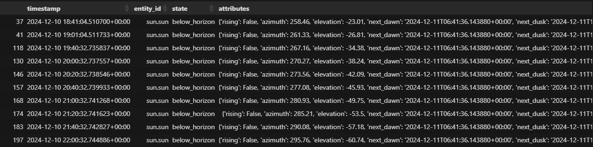
Dato sin limpiar tal y como viene de la base de datos (timestamp, entity_id, state y el attributes con azimuth/elevation).

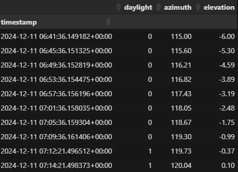
Transformación principal ya hecha (daylight + azimuth + elevation).

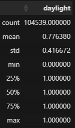
El promedio deja en evidencia que en un 77% son momentos en los que hay sol durante el día.

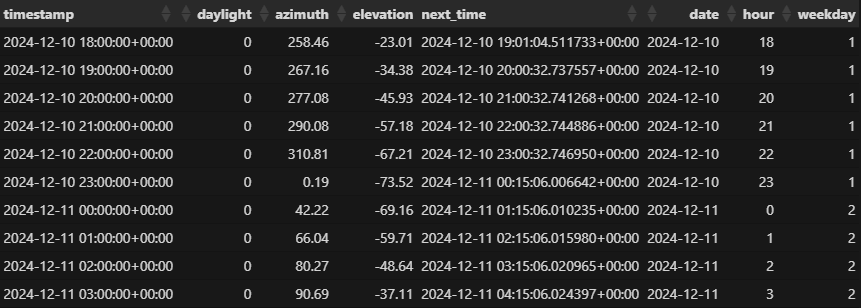
Resultado final listo para Silver, con las columnas auxiliares date/hour/weekday (y next_time).

#### 3.1.4 Meteo Mislata

Estos datos aportan el contexto ambiental ayudando a interpretar correctamente la evolución térmica interior.

Encontramos dos grupos de mediciones de meteorologia, de Valencia/Aeropuerto y de Mislata.  Dado que vamos a analizar los datos de la ubicación de Mislata nos centramos en ellos.

Analizando los datos vemos los datos faltantes, nubosidad, y se puede observar que existe una gran cantidad de valores faltantes:
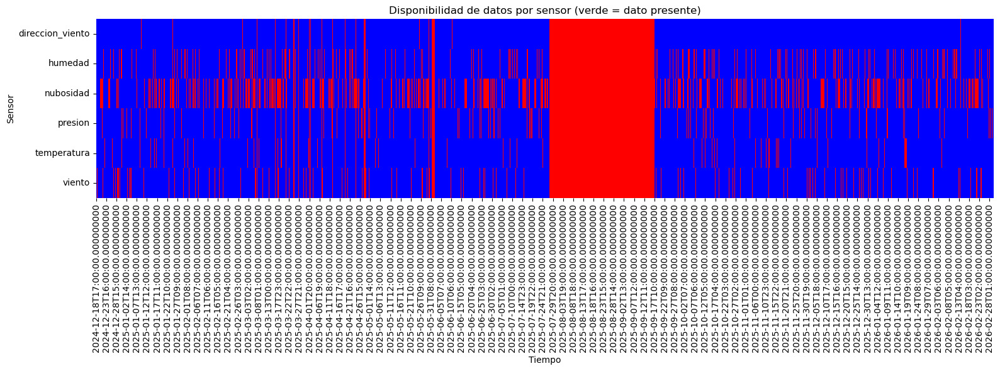

Analizamos los huecos:

````
rows_all_nan = df_mislata_wide[sensor_cols].isna().all(axis=1)

gap_sizes = rows_all_nan.astype(int).groupby(
    (rows_all_nan != rows_all_nan.shift()).cumsum()
).sum()

print(gap_sizes.describe())
````

````
count     153.000000
mean        9.071895
std        99.435519
min         0.000000
25%         0.000000
50%         0.000000
75%         1.000000
max      1230.000000
dtype: float64
````

- En promedio los huecos son de 9h, en promedio los huecos son muy pequeños y el 75% duran menos de 1H y hay un hueco muy grande. Así que lo suyo es eliminar los huecos de 24h.
- Como tenemos un 18% 20% de datos faltantes por sensor no podemos eliminarlos, entonces **una opción es interpolar** los datos que faltan ya que los datos que faltan no son tramos muy extensos

Interpolamos los huecos pequeños de datos faltantes:

````
df_mislata_wide = df_mislata_wide[~(rows_all_nan & (gap_sizes > 24))]

# interpolar huecos pequeños
df_mislata_wide[sensor_cols] = df_mislata_wide[sensor_cols].interpolate(
    method="time",
    limit=3
)
````

De esta forma mejoramos la cantidad de datos que tenemos.

**Problemas detectados**

- Huecos de información (filas/periodos con variables meteorológicas ausentes).
- Tramos donde todas las variables están a NaN.
- Alta proporción de faltantes en nubosidad.
- Riesgo de introducir sesgo si se interpolan tramos largos sin control.

**Limpieza / Transformación**

- Conversión de state a numérico (coerción a NaN en valores no válidos).
- Resample horario (media) para alinear con el resto de grupos.
- Identificación de huecos largos y eliminación de tramos con ausencia total prolongada (>24h).
- Interpolación temporal limitada para huecos pequeños (limit=3).
- Eliminación de nubosidad por baja calidad (faltantes elevados).

---

## 4. Modelo ML de calefacción

El proyecto incorpora un paso intermedio para inferir estado de calefaccion por hora desde temperatura. Dado que el control de la calefacción se hace con sensores de otra sala, necesitamos correlacionar este sensor de temperatura con el que disponemos.

Para ello se pretende inferir la temperatura en la sala que controla la calefaccion mediante el sensor del aula.

Para ello se cargan los datos del sensor usado para la calefacción [History_2025-09-01_100-2026-03-02_1400.csv](data/lake/bronze/sensor_calefaccion/History_2025-09-01_100-2026-03-02_1400.csv)
Se cargan los datos de temperatura del aula `data/lake/silver/temperatura.csv`.

Se limpian y unen en un dataset por fecha y hora. Se define el target la temperatura del sensor de la calefacción y se usa la temperatura del aula para el entrenamiento.

Para el entrenmaiento se usa la siguiente arquitectura:

**Partición de datos**:

- 80% entrenamiento, 20% test
- `random_state=42` para reproducibilidad

Obtenemos las métricas de validación:

**Métricas de validación**:

- **MAE** (Mean Absolute Error): 0.75°C → error medio < 1°C
- **RMSE** (Root Mean Squared Error): 0.99°C → penaliza errores grandes pero siguen siendo < 1°C
- **R²**: 0.91 → explica 91% de la variabilidad de temperatura

Con lo que obtenemos un modelo que cubre de forma adecuada la predicción que queriamos hacer con errores muy bajos.

---

## 5. ETL por capas (`src/etl.py`)

### Estructura del Datawarehouse

```
data/lake/
│
├── sensors/
│   ├── ltss_sensores.csv          # Dataset base
│   └── ltss_sensores.parquet      # Dataset en formato parquet
│
├── bronze/
│   └── sensor_calefaccion/
│       └── History_2025-09-01_100-2026-03-02_1400.csv
│
├── silver/
│   ├── temperatura.csv   
│   ├── humedad.csv
│   ├── puertas_ventanas.csv
│   ├── sol.csv
│   ├── weather_mislata.csv
│   ├── calefaccion.csv
│   └── models/        
│       ├── modelo_regresion_temperatura.pkl  # Modelo de regresion
│       ├── model_16_1/                       # Modelos evaluados
│       ├── model_32_16_1/
│       ├── model_32_64_32_16_1/
│       ├── model_64_32_16_1/
│       ├── model_64_32_16_8_1/
│       ├── model_128_32_1/
│       └── model_128_64_32_1/
├── gold/
│
└── logs/
    └── etl_log_buffer.sqlite       # Logs de ejecución ETL
```

### 5.1 Bronze

Función: `extract_db_to_bronze(...)`

- Conecta a PostgreSQL/TimescaleDB.
- Extrae histórico (`get_db_data`).
- Normaliza columna `attributes`.
- Guarda dataset base en `data/lake/sensors/` (`ltss_sensores.csv` y parquet).

### 5.2 Silver

Función: `prepare_silver(...)`

Genera salidas de los sensores agrupados por horas limpias listos para usar en el modelo de Red Neuronal:

Aplica el modelo de regresión para inferir la temperatura predicha y el estado de calefacción a partir de temperatura del aula y las reglas de encendido de la calefacción.

**Obtenemos**

- `temperatura.csv`
- `humedad.csv`
- `puertas_ventanas.csv`
- `sol.csv`
- `weather_mislata.csv`
- `calefaccion.csv`

### 5.3 Gold

Funcion: `prepare_gold(...)`.

Se deja preparado por si se necesitara en un futuro.

---

## 6. Red neuronal de derroche (`RedNeuronal.ipynb`)

### 6.1 Fuente de datos

El modelo se entrena cargando los 6 datasets Silver generados por ETL:

```python
df_temp = pd.read_csv("../../data/lake/silver/temperatura.csv")
df_hum = pd.read_csv("../../data/lake/silver/humedad.csv")
df_weather = pd.read_csv("../../data/lake/silver/weather_mislata.csv")
df_puertas = pd.read_csv("../../data/lake/silver/puertas_ventanas.csv")
df_calef = pd.read_csv("../../data/lake/silver/calefaccion.csv")
df_sol = pd.read_csv("../../data/lake/silver/sol.csv")
```

Posteriormente se unifican por fecha y hora en un dataframe unico (`df`). En los siguientes puntos veremos el análisis y decisiones.

### 6.2 Definición del target (derroche)

Se define derroche. Tras analizar el problema:
Para la detección de situaciones de derroche energético se ha establecido un tiempo de 600 segundos (10 minutos) de apertura acumulada de puertas o ventanas dentro de una hora, siempre que la calefacción esté encendida.

Este valor se ha seleccionado buscando un equilibrio entre dos factores clave:

* Por un lado, se pretende evitar falsos positivos, ya que aperturas breves (por ejemplo, ventilaciones puntuales o entradas y salidas rápidas) son comportamientos normales.
* Por otro lado, se busca detectar situaciones reales de pérdida energética, donde la apertura prolongada sí provoca una disminución de la eficiencia térmica del aula.

El valor de 600 segundos (10 minutos) representa un un tiempo adecuado de ventilación y más de ello puede considerarse que es excesivo. Un tiempo inferior podria considerarse excesivo dando alertas falsas de olvido de puerta/ventana abierta.

En consecuencia, el umbral de 600 segundos se considera una elección adecuada, permitiendo identificar situaciones de derroche reales sin introducir ruido innecesario en el modelo de predicción

**Lógica**:

- Calefacción debe estar encendida (`calefaccion_on == 1`).
- Suma de apertura de puertas/ventanas debe superar 10 minutos en esa hora.

```python
open_threshold_seconds = 10 * 60  # 10 minutos

cond = (
    (df["calefaccion_on"] == 1) &
    (df["open_seconds"] > open_threshold_seconds)
)

df["derroche"] = cond.astype("Int64")
```

**Target a predicción** (desplazamiento a +1 hora):
Con el objetivo de adaptar el problema a un escenario de predicción, se ha aplicado un desplazamiento temporal sobre la característica de derroche utilizando la operación shift(-1). Esta transformación permite alinear los datos de entrada de una hora determinada con el estado de derroche de la hora siguiente.

Este enfoque convierte el problema en un modelo de predicción anticipada, en lugar de una simple detección en tiempo real. Esto es especialmente relevante en el contexto del proyecto, ya que permite identificar situaciones de ineficiencia energética antes de que ocurran.

```python
df["derroche_next_hour"] = df["derroche"].shift(-1)
```

#### **Se detecta un dataset muy desbalanceado:**

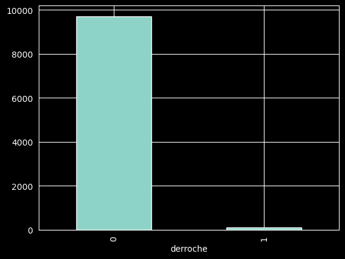

#### Características redundantes:

- azimuth ≈ hour → redundante nos quedamos con hour
- daynight ≈ elevation → redundante nos quedamos con elevation

Hay otras variables que correlacionan de forma alta pero consideramos que son importante para el modelo por su significado.

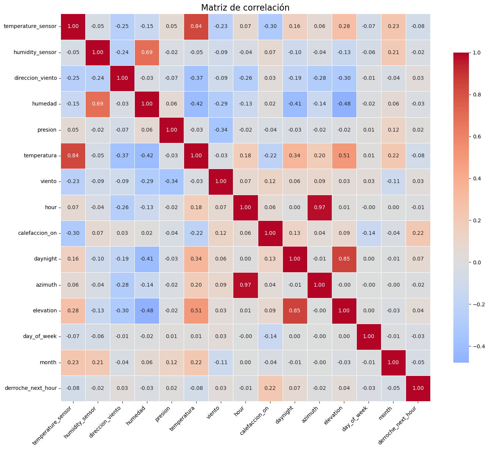

#### Ingeniería de características

Para mejorar los resultados hemos hecho ingenieria de características:

* Se ha incorporado la variable **diferencia de temperatura** y **diferencia de humedad** (interior − exterior) como feature adicional. No se han eliminado las variables originales, ya que la diferencia no contiene toda la información de estas, sino que aporta una visión complementaria.
* Las **variables temporales** se han transformado mediante **funciones seno y coseno** para representar su naturaleza cíclica, permitiendo a la red neuronal capturar patrones periódicos en el uso del aula.
  - Las variables temporales como la hora del día y el día de la semana presentan un comportamiento cíclico, es decir, sus valores se repiten de forma periódica (cada 24 horas y cada 7 días respectivamente).

    Sin embargo, si se utilizan directamente como valores numéricos enteros, el modelo interpreta que la distancia entre valores es lineal. Por ejemplo, considera que la hora 23 está muy alejada de la hora 0, cuando en realidad son momentos consecutivos.

    Para evitar este problema, se transforman estas variables mediante funciones seno y coseno, proyectándolas en un espacio circular. De este modo, se preserva la naturaleza cíclica del tiempo, ya que valores cercanos en el ciclo (como 23 y 0) también quedan próximos en la representación.

    Esta transformación permite a la red neuronal capturar patrones periódicos en el comportamiento del aula, como diferencias entre mañanas y tardes o entre días laborables y fines de semana, mejorando así su capacidad de generalización.

#### **Selección de características**

**Eliminadas** del modelo por ser predictoras directas del target:

```python
drop_cols = [
    "open_seconds",           # Componente directo de derroche
    "derroche",               # Target actual (no future)
    "percent_open_time",      # Derivada de open_seconds
    "open_flag",              # Indicador de apertura
    "weekday"                 # Opcional: evita capturar patron periodico en train/test
]
```

**Preservadas** (features validas):

1. Se eliminan columnas redundantes tras analisis de correlación.
2. Se aplica **`StandardScaler`** para normalizar features.
3. Se particionan datos en train (80%) y test (20%) con `random_state=42` y los de entrenamiento en 70/30 para validación durante el entrenamiento.

````
DATOS TOTALES

│
├── TRAIN (80%)
│   ├── TRAIN interno (70%)
│   └── VALIDATION (30%)
│
└── TEST (20%)  ← intocable hasta el final
````

Además vamos a utilizar una técnica de balanceo de clases llamada `class_weight` durante el entrenamiento:

- Calcula pesos para cada clase (0 y 1) en función de cuántas muestras hay.
- Debido al desbalanceo del dataset, donde la clase de derroche es minoritaria, se emplea class_weight='balanced' para asignar mayor peso a esta clase durante el entrenamiento. Esto permite penalizar más los errores asociados a eventos de derroche, evitando que el modelo se sesgue hacia la clase mayoritaria y mejorando su capacidad de generalización en la detección de casos poco frecuentes.
- Esta técnica es especialmente relevante en problemas desbalanceados, donde métricas como la accuracy pueden resultar engañosas, y se prioriza mejorar el recall y el F1-score de la clase minoritaria.

Vamos a entrenar el modelo con:

- 50 epochs
- Adam optimizer
- Binary crossentropy loss
- Vamos a entrenar los modelos de las redes:

````
architectures = [
    [16, 1],
    [32, 16, 1],
    [64, 32, 16, 1],
    [128, 64, 32, 1],
    [64, 32, 16, 8, 1],
    [32, 64, 32, 16, 1],
    [128, 32, 1]
]
````

#### RESULTADOS

- Vemos los resultados del entrenamiento, la pérdida, la precisión, sensibilidad.
- El F1-Score con el mejor umbral para cada modelo.
- La gráfica de umbrales para cada modelo.

**La pérdida, la precisión, sensibilidad. por época y modelo**

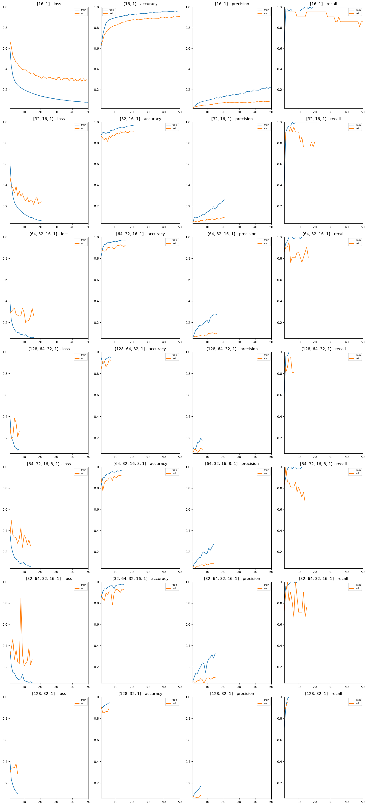

**El F1-Score con el mejor umbral para cada modelo.**
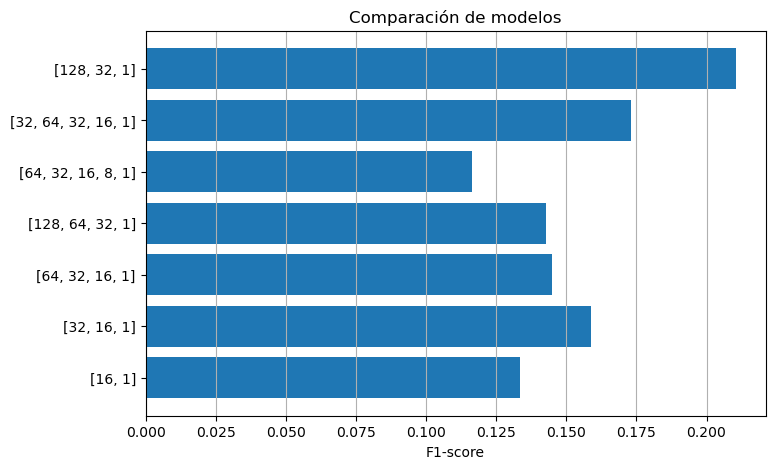

**En lugar de usar umbral fijo 0.5, se evalua el umbral que maximiza F1 en validación:**

```python
optimal_threshold = argmax([f1_score(y_val, y_pred_proba > t) for t in thresholds])
```

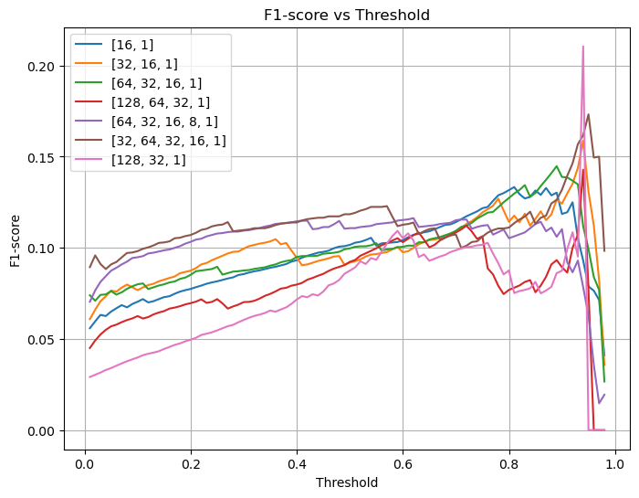

Por cada arquitectura se calcula:

- Matriz de confusión
- Precision, recall, F1
- Umbral óptimo por F1

Se selecciona la arquitectura con mejor F1 en test, balanceando recall (detección de derroche) vs. precision (falsos positivos).

#### Selección del modelo de red neuronal

A priori parece que la selección del mayor F1-score podria ser la mejor elección pero si analizamos el caso que nos ocupa necesitamos detectar los casos de derroche.

```
PREDICCIÓN
                ┌─────────┬─────────┐
                │   0     │    1    │
┌───────────────┼─────────┼─────────┤
│ REAL     0    │   TN    │   FP    │
│               │         │         │
├───────────────┼─────────┼─────────┤
│ REAL     1    │   FN    │   TP    │
│               │         │         │Sensibilidad
└───────────────┴─────────┴─────────┘
.                          Precision

Recall (sensibilidad) = TP / (TP + FN)
Precision = TP / (TP + FP)
```

Es por ello que deberiamos fijarnos en la sensibilidad para una mejor elección para maximizar la eficiencia de detección de casos de derroche.


| Modelo          | TP     | FN    | FP    | Recall   | Precision |
| --------------- | ------ | ----- | ----- | -------- | --------- |
| [16,1]          | **21** | **4** | 269   | **0.84** | 0.07      |
| [64,32,16,8,1]  | 20     | 5     | 299   | 0.80     | 0.06      |
| [64,32,16,1]    | 16     | 9     | 180   | 0.64     | 0.08      |
| [32,64,32,16,1] | 11     | 14    | 91    | 0.44     | 0.11      |
| [32,16,1]       | 10     | 15    | 91    | 0.40     | 0.10      |
| [128,64,32,1]   | 6      | 19    | 53    | 0.24     | 0.10      |
| [128,32,1]      | 4      | 21    | **9** | 0.16     | **0.31**  |

Dado que el objetivo del sistema es detectar situaciones de derroche energético, se prioriza un mayor recall.

Se observan tres comportamientos diferenciados:

#### Modelos con alto recall

- [16,1]
- [64,32,16,8,1]

Detectan la mayoría de los derroches, pero generan un número muy elevado de falsos positivos, lo que puede afectar a la usabilidad del sistema.

---

#### Modelos equilibrados

- [64,32,16,1]
- [32,64,32,16,1]
- [32,16,1]

Presentan un mejor compromiso entre recall y precisión, reduciendo los falsos positivos sin dejar de detectar una parte significativa de los derroches.

---

#### Modelos conservadores

- [128,32,1]
- [128,64,32,1]

Tienen métricas globales altas (accuracy, F1), pero un recall muy bajo, por lo que no resultan adecuados para este problema.

---

El modelo [16, 1] consigue el mayor recall (0.84), detectando 21 de los 25 casos de derroche y minimizando los falsos negativos. Sin embargo, genera un número elevado de falsos positivos (269), lo que puede provocar un exceso de alertas.

Por otro lado, el modelo [32, 64, 32, 16, 1] ofrece un mejor equilibrio entre recall (0.44) y precisión (0.11), reduciendo significativamente los falsos positivos (91), aunque detecta menos casos de derroche.

La elección del modelo depende del coste asociado a los errores:

- Si se prioriza **no perder derroches (minimizar FN)** → se selecciona el modelo **[16, 1]** A este modelo le llamamos modelo A
- Si se busca un sistema más **equilibrado** → se selecciona el modelo **[32, 64, 32, 16, 1]** A este modelo le llamamos modelo B

Dada la poca cantidad de derroches optariamos por el modelo A que aunque genere falsos positivos nos asegura no perder situaciones de derroche ante la baja incidencia de estos casos.

2. **Optimizacion de umbral por F1**:

En lugar de usar umbral fijo 0.5, se evalua el umbral que maximiza F1 en validación:

```
optimal_threshold = argmax([f1_score(y_val, y_pred_proba > t) for t in thresholds])
```

## 7. API de inferencia y dashboard

Se genera una API de consumo de los modelos seleccionados mediante FlaskAPI.
Mediante docker, se genera un contenedor de ejecución para la API.[docker-compose.yml](docker/docker-compose.yml)

### Grafana

Se genera un panel de visualización en tiempo real de los sensores de temperatura y humedad.


### API (`src/api.py`)

Endpoints principales:

- `GET /health`: comprueba que la API está operativa y devuelve estado, versión/modelo cargado y modelos disponibles.
- `GET /models`: lista los modelos disponibles y cuál se usa por defecto.
- `POST /predict`: ejecuta una predicción de derroche con los datos enviados en el JSON (incluye selección opcional de modelo).
- `GET /mislata`: Obtiene datos meteorológicos actuales de Mislata (Valencia).
- `GET /sun`: Obtiene datos solares de Mislata para timestamp dado o actual.
- `POST /predict/mislata`: ejecuta la predicción combinando sensores interiores del JSON con meteo y datos solares de Mislata para la hora objetivo.

### APP (`src/app/ui/dashboard.py`)

Aplicación Flet de escritorio para operar el sistema de predicción de derroche de forma interactiva.

Capacidades principales:

- Selección de fecha/hora y modelo de inferencia disponible en API.
- Edición manual de variables interiores y exteriores (temperatura, humedad, viento, dirección y elevación solar).
- Autocompletado de meteo/sol para Mislata desde la API (`/mislata` y `/sun`) con refresco bajo demanda.
- Carga y validación de programación de calefacción desde JSON (por ruta o selector de archivo), con visualización tabular semanal.
- Predicción puntual para una hora concreta y predicción multihora (6 horas) con simulación del estado de calefacción según la programación cargada.
- Visualización de resultados con alerta/no alerta, confianza, probabilidad y umbral aplicado por modelo.

Ademas, la UI guarda configuracion local (modelo y última programación válida) para mantener continuidad entre sesiones.

Entrada principal UI: `src/app/main.py`.
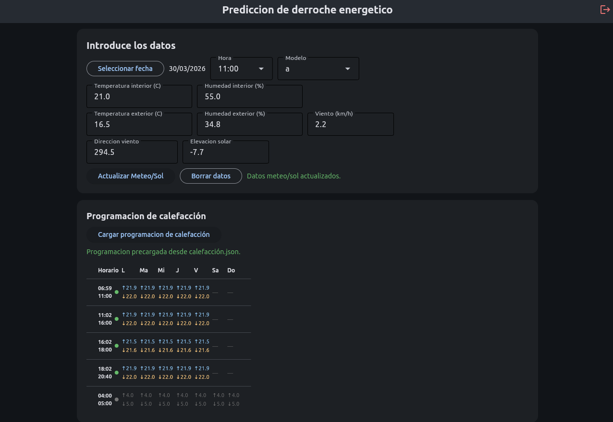
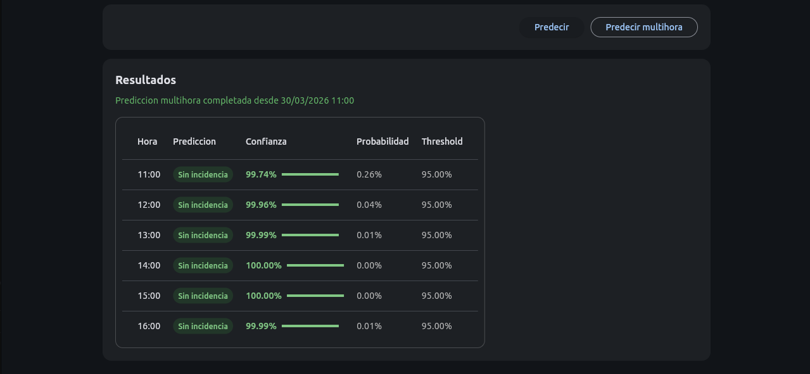
----------------------------

## 8. Estructura funcional

```bash
notebooks/
  EDA/
	EDA_History.ipynb
	EDA_temperatura_puertas-ventanas_v2.ipynb
	EDA_humedad_sol.ipynb
	EDA_weather-mislata.ipynb
	RedNeuronal.ipynb
docker/
  docker-compose.yml
  Dockerfile.api      #Dockerfile para la API
src/
  etl.py
  etl_logger.py
  api.py
  inference_service.py
  app/
	main.py
	ui/dashboard.py
  model/
    a/
      model.keras
      model.h5
      scaler.pkl
      config.json
    b/
      model.keras
      model.h5
      scaler.pkl
      config.json
data/lake/
  sensors/
  bronze/
  silver/
	models/
  gold/
```

---

## 9. Flujo

1. Extraer histórico bruto desde PostgreSQL/TimescaleDB.
2. Generar el modelo de ML para temperatura de calefacción
3. ETL para normalizar y persistir base en Bronze/Sensors.
4. ETL para transformar a series horarias en Silver.
5. Inferir estado de calefacción.
6. Entrenar/evaluar modelo de derroche.
7. Copiar el modelo a /src/model/modelname.
8. Levantar el docker de la API.
9. Consumir predicción desde dashboard.

---

## 10. Ejecucion

### 10.1 Entorno local (Python)

Opción con `venv` y `requirements.txt`:

```bash
cd /home/jevallo/workspace/IABD/Proyectos
python3 -m venv .venv
source .venv/bin/activate
pip install -r requirements.txt
```

Opción con Conda para entrenamiento:

```bash
cd /home/jevallo/workspace/IABD/Proyectos
conda env create -f environment.tensorflow.yml
conda activate tensorflow
```

### 10.2 Variables de entorno ETL

`src/etl.py` espera credenciales de BD por variables de entorno (o `src/.env`), incluyendo:

```
DB_USER=postgres
DB_PASSWORD=
DB_HOST=127.0.0.1
DB_PORT=5432
DB_NAME=postgres
ETL_LOG_TARGET=consola
ETL_LOG_SQLITE_BUFFER_PATH=../data/lake/logs/etl_log_buffer.sqlite
MYSQL_LOG_USER=etl_logger
MYSQL_LOG_PASSWORD=
MYSQL_LOG_HOST=127.0.0.1
MYSQL_LOG_PORT=3306
MYSQL_LOG_DB=etl_logs
```

### 10.3 Docker Compose

El proyecto incluye `docker/docker-compose.yml` con servicios `api`, `db`, `grafana` y `logs_db`.

```bash
cd /home/jevallo/workspace/IABD/Proyectos
docker compose -f docker/docker-compose.yml up -d --build
docker compose -f docker/docker-compose.yml ps
```

### 10.4 Lanzar ETL

```bash
cd /home/jevallo/workspace/IABD/Proyectos
python src/etl.py
```

### 10.5 Levantar API

```bash
docker-compose up --build --force-recreate api
```

Prueba rápida:

```bash
curl -s http://127.0.0.1:8000/health
curl -s http://127.0.0.1:8000/models
```

### 10.6 Levantar UI (Flet)

```bash
python -m src.app.main
```

---

## Warnings

- Etiquetado de calefacción inferido (no siempre observado directamente).
- Huecos largos en series IoT y calidad variable de integraciones externas.
- Dependencia de programación horaria y contexto operativo del aula.
- En escenarios desbalanceados, accuracy no es métrica suficiente.
- F1 + umbral optimizado + class weighting mejoran detección de eventos raros.
- Separar inferencia de calefacción y predicción de derroche mejora mantenibilidad.

---

## 13. Mejoras futuras

- Features temporales (lags y ventanas móviles).
- Calibración de probabilidades y coste por falso negativo.
- Pruebas con dataset balanceado con datos sintéticos aumentados.
- Alertas automáticas integradas con Home Assistant.
